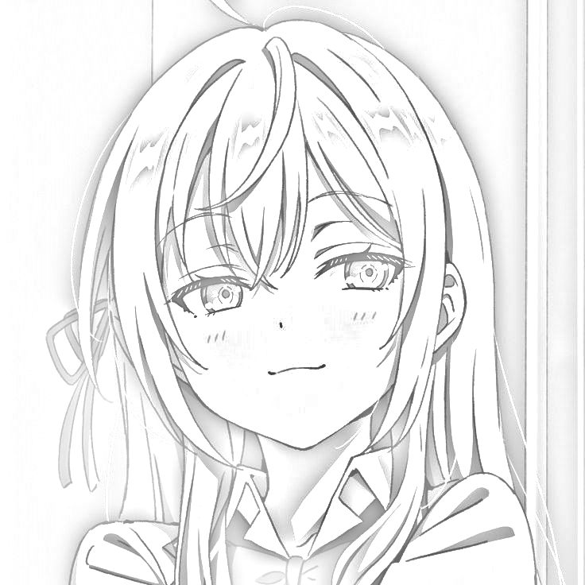

# Image to Sketch Converter

This project provides a Python script to convert an image into a pencil sketch using simple image processing techniques. The script uses libraries such as `NumPy`, `ImageIO`, `SciPy`, and `OpenCV`.

## Features
- Converts any image to a grayscale pencil sketch.
- Allows customization of the sketching effect by adjusting the Gaussian blur intensity.
- Simple and easy to use.

## Requirements

Before running the script, make sure the following Python libraries are installed:

- `numpy`
- `imageio`
- `scipy`
- `opencv-python`

You can install these using pip:

```bash
pip install numpy imageio scipy opencv-python
```

---

## Usage

### 1. Input Image
Prepare the image you want to convert (e.g., `test.jpeg`) and place it in the same directory as the script.

---

### 2. Run the Script
Execute the script in your terminal:

```bash
python main.py
```

By default, the script processes the test.jpeg file and saves the output as test_coloring.png.

### 3. Run the Script
You can modify the script to use a different input image, output file name, or adjust the Gaussian blur intensity by editing the following lines in the script:

```python
input_image = 'your_image.jpeg'  # Path to your input image
output_image = 'your_output.png'  # Path to save the output sketch
blur_sigma = 13  # Adjust the blur intensity
```

---

## How It Works

### 1. Grayscale Conversion
The RGB image is converted to grayscale using a weighted sum of the RGB channels

### 2. Inversion: 
The grayscale image is inverted to create a negative.

### 3. Gaussian Blur:
The inverted image is blurred using a Gaussian filter to soften it.

### 4. Dodge Effect:
The dodge effect combines the blurred and original grayscale images to create a pencil sketch appearance.

---

## Example Output

| **Original Image**     | **Pencil Sketch**            |
|------------------------|------------------------------|
|  |  |